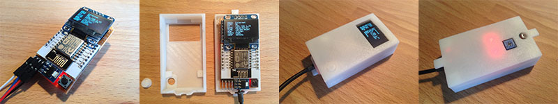

# Internet-of-Things Power Meter

The Internet-of-Things Power Meter (IPM) is a device fixed on top of the regular household power meter and provides detailed information about the electricity usage. Modern power meters have a LED blinking every time a Watt is used, the IPM detects these flashes using a light sensor, counts them and saves the values to an SD card. Later the data is stored on the cloud.

Usually power companies provide very rough electricity usage data, the IPM provides data with a minute resolution. Knowing the household electricity usage allows to extrapolate statistics and can give precise numbers about the costs.

The IPM was made with simplicity of assembly and cost in mind. The device is easy to build, program and cheap to deploy and use. One can basically buy the parts, assemble, program and deploy it without any knowledge about the inner workings, however contribution to the development of this open-source project is welcome and encouraged.

This is the second iteration of the electricity usage monitor project, the [first version can be seen here](https://github.com/Nurgak/Electricity-usage-monitor).

# Documentation

During development the IPM project is [documented on hackaday.io](https://hackaday.io/project/6938-internet-of-things-power-meter).

# License

The software is licensed under [GNU General Public License](https://en.wikipedia.org/wiki/GNU_General_Public_License).

The hardware is licensed under [Creative Commons Attribution-ShareAlike 4.0 International License](http://creativecommons.org/licenses/by-sa/4.0/).

